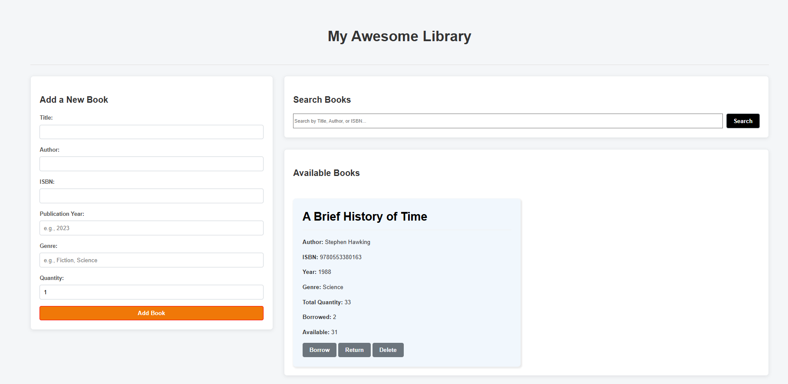

# 📚 Library Management System


*A simple yet functional Library Management System built using HTML, CSS, and JavaScript (ES Modules). This system allows users to:*

- Add new books with relevant details

- Search books by title, author, genre, or ISBN

- Borrow and return books

- Delete books from the collection

- Persist data using Local Storage


## Project Structure

```bash
📁 library-management/
├── index.html
├── style.css
├── script.js
├── books.js
├── library.js
└── README.md


```

## 📦 Features

- Add Books: Title, Author, ISBN, Publication Year, Genre, Quantity

- Search Books: Real-time and click-based search

- Borrow/Return: Tracks how many books are available or borrowed

- Delete Books: Remove books by ISBN

- Data Persistence: LocalStorage integration for saving data across sessions

- Modular Codebase: Clean separation using ES Modules (import/export)

## 🚀 How to Run

- Clone or download the repository.

- Open index.html in any modern browser (like Chrome or Edge).

- Start managing your library!

- ✅ No server setup needed – this is a fully client-side application.

## 📘 File Descriptions

**books.js**

- Defines the Book class:

- Holds data: title, author, isbn, publicationYear, genre, quantity, and borrowedCopies

- Provides methods:

- getAvailableCopies()

- borrowCopy()

- returnCopy()

- getDetailsObject()

**library.js**

- Defines the Library class:

- Manages all book records

- Methods include:

```bash
i)addBook(book),

ii)findBookByISBN(isbn),

iii)deleteBookByISBN(isbn),

iv)borrowBookByISBN(isbn),

v)returnBookByISBN(isbn),

vi)searchBooks(query),

vii)saveToLocalStorage(),

viii)loadFromLocalStorage()

```

**script.js**
_Main UI interaction logic:_

- Loads and renders the book list

- Listens for form submissions

- Handles search, add, borrow, return, and delete actions

- Shows modal dialogs for notifications

**index.html**
_Main UI interface for:_

- Adding books

- Searching the catalog

- Viewing available books

- Interacting with buttons (borrow/return/delete)

- Includes dialog modal support for showing feedback to the user.

### Screenshot



#### [🚀 View Live Demo](https://charudatta270104.github.io/library_management/)
